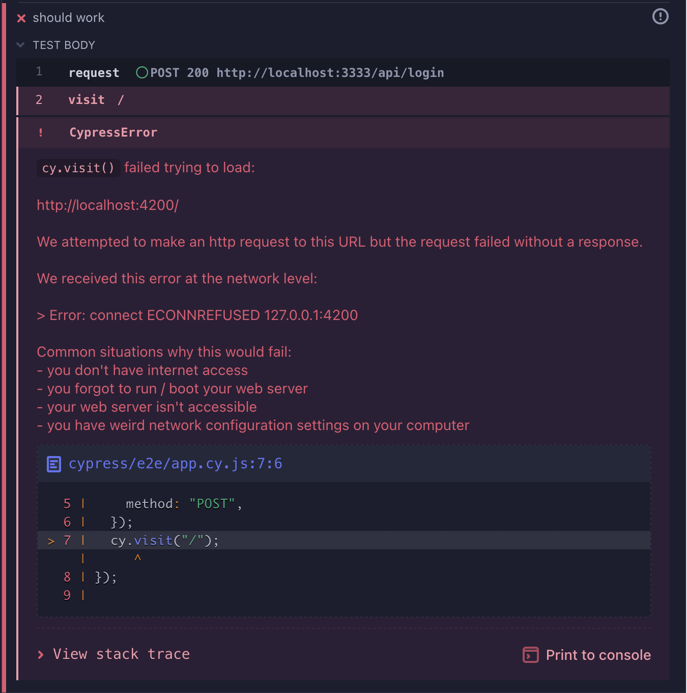

# Cypress request/visit bug

This repro demonstrates a bug where a `cy.request` to a localhost server connected to ipv4 (127.0.0.1) influences later requests, notably `cy.visit`. In this case, we have a backend server running on "127.0.0.1" and a front-end server running on "::1" (both can be accessed with `localhost`).

To replicate the bug:

- In a separate terminal run `npm run serve`
- In a separate terminal run `npm run server`
- In a separate terminal run `npx cypress open`
  - Choose e2e testing
  - Choose any browser
  - Choose `app.cy.js`

The first request is made to `http://localhost:3333/api/login` and the visit is configured to visit `http://localhost:4200` via the configured baseUrl. The issue is that the frontend server is not available at `http://127.0.0.1:4200` but rather `http://[::1]:4200`.

If the request is moved after the visit, everything works fine.

If the request is commented out and Cypress is allowed to visit successfully, commenting the request back in works fine.

> Note: Cypress needs to be killed and restarted to reset the server state.

I believe the issue lives with the server first connecting to an ipv4 address due to the request (127.0.0.1) and then coercing the visit to `http://localhost:4200` to `http://127.0.0.1:4200`. 